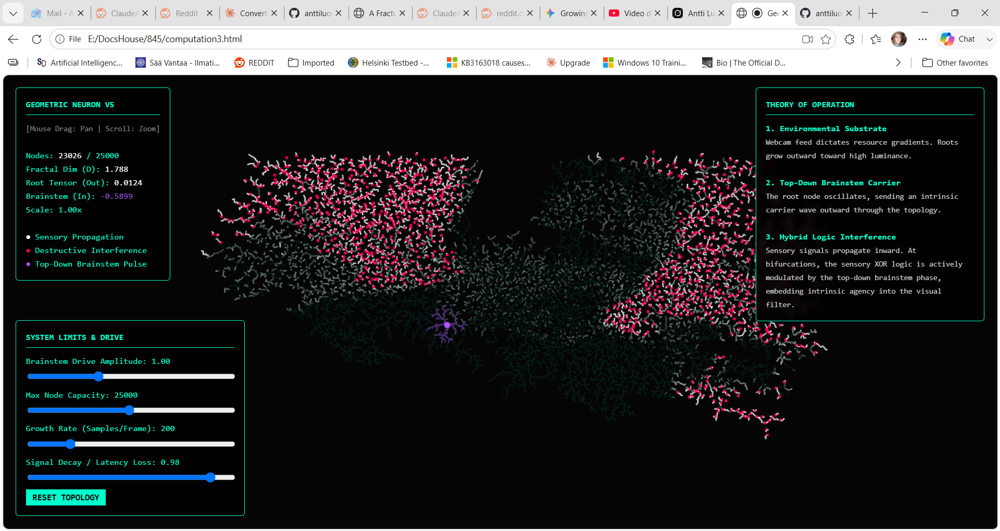

# **Geometric Neuron V6: TRT & Resonator ALU**

Live at: https://anttiluode.github.io/GeometricNeuronFractal/

**Dynamic Topology, Oscillator Arithmetic, and Resonant Memory**  
*Where $1 \+ 1 \+ 1 \= \\pi$*  
Traditional Artificial Neural Networks (ANNs) rely on rigid, static weight matrices and linear addition\[cite: 7\]. The **Geometric Neuron** abandons this in favor of dynamic, biological fractal growth and continuous wave interference\[cite: 7\].  
In a standard digital adder, $1 \+ 1 \= 10$ (binary)\[cite: 7\]. In a resonant phasor network, discrete signals are mapped as complex wave phases ($1 \\to \-1$, $0 \\to \+1$)\[cite: 7\]. When you add sequential signals across spatial delays, you are not accumulating scalar values; you are rotating a vector through phase space\[cite: 7\]. Accumulating discrete logical "ones" across a cyclic topology maps directly onto a continuous circular geometry—meaning logical addition fundamentally equals $\\pi$\[cite: 7\].

## **The Architecture**

This repository contains a live, browser-based implementation of a foveated cortical loop\[cite: 7\]. The network physically builds itself in real-time by sampling a webcam feed, growing a topological map of its environment, and decomposing 1D carrier signals into topological invariants\[cite: 6, 7\].

### **Core Mechanics**

1. **Environmental Substrate (Growth)**  
   Dendritic branches dynamically sprout toward high-luminance gradients in the live video feed\[cite: 6, 7\]. The network remains inherently sparse, only expending computational resources where environmental data exists\[cite: 7\].  
2. **Top-Down Brainstem Pulse (Anterograde)**  
   The root node (the "Soma") acts as a biological pacemaker\[cite: 7\]. It generates a continuous sinusoidal carrier wave that washes outward through the entire dendritic tree\[cite: 6, 7\].  
3. **TRT Decomposition & Phasor ALU (Retrograde)** The network utilizes the **Takens-Rajapinta Transform (TRT)** at every node. By applying a delay-space embedding ($X\_t \= \[x\_t, x\_{t-\\tau}, x\_{t-2\\tau}\]$) to the local signal history, the network decomposes temporal signals into topological invariants (phase curvature). These invariants are fed into an internal analog Arithmetic Logic Unit (ALU), executing continuous XOR/AND logic via pure wave cancellation.  
4. **Dimensional Collapse & Resonant Memory Loops** The network organically prunes its phase space via destructive interference (visualized as red nodes), ensuring only structurally sound, resonant patterns survive. Nodes acting as leaky integrators trap propagating TRT invariants. If the local geometry sustains a standing wave, the branch becomes a "frozen" memory register (visualized as purple clusters), locking in short-term spatial representations\[cite: 6, 7\].

## **HUD & Controls**

* **Mouse Drag & Scroll:** Pan and zoom through the fractal topology\[cite: 6, 7\].  
* **Root Tensor:** The final collapsed wave signature arriving at the root node\[cite: 6, 7\].  
* **TRT Time Delay ($\\tau$):** Adjusts the sliding window used by the Takens-Rajapinta Transform to calculate phase curvature.  
* **Brainstem Amp:** Adjusts the amplitude of the top-down oscillatory drive\[cite: 6, 7\].  
* **Growth Rate:** Dictates how aggressively the network samples the environment for new resources per frame\[cite: 6, 7\].  
* **Toggle Memory Loops:** Enables/disables the topological trapping of standing waves\[cite: 6, 7\].

## **Future Development**

With the TRT successfully extracting phase curvature and feeding it into the phasor logic, the network is now capable of classifying complex spatiotemporal patterns using nothing but its own branch geometry.  
Future iterations will explore output routing—specifically, utilizing the root tensor to drive external audio/motor systems, or allowing the root to sprout secondary "efferent" networks for complex environmental interaction.

## **License**

See the LICENSE file for details\[cite: 7\].  
